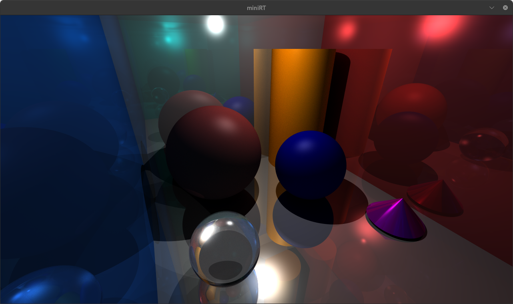
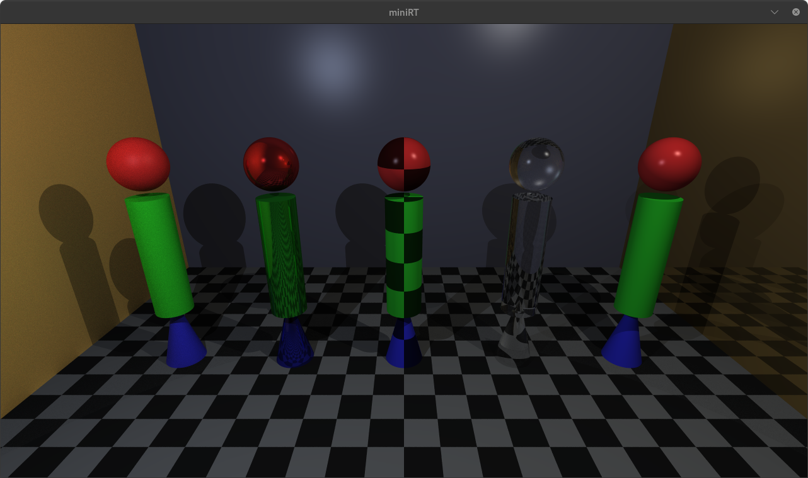
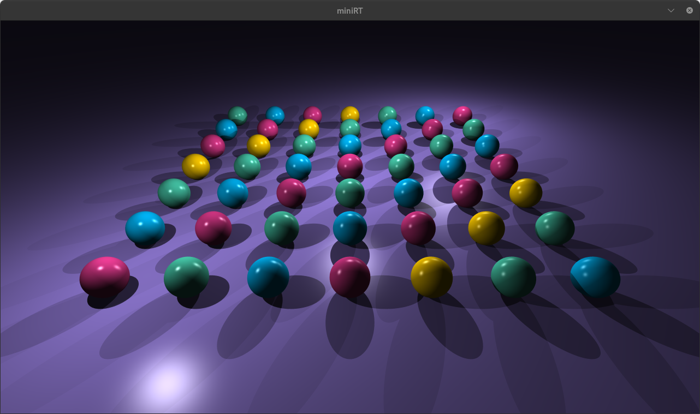
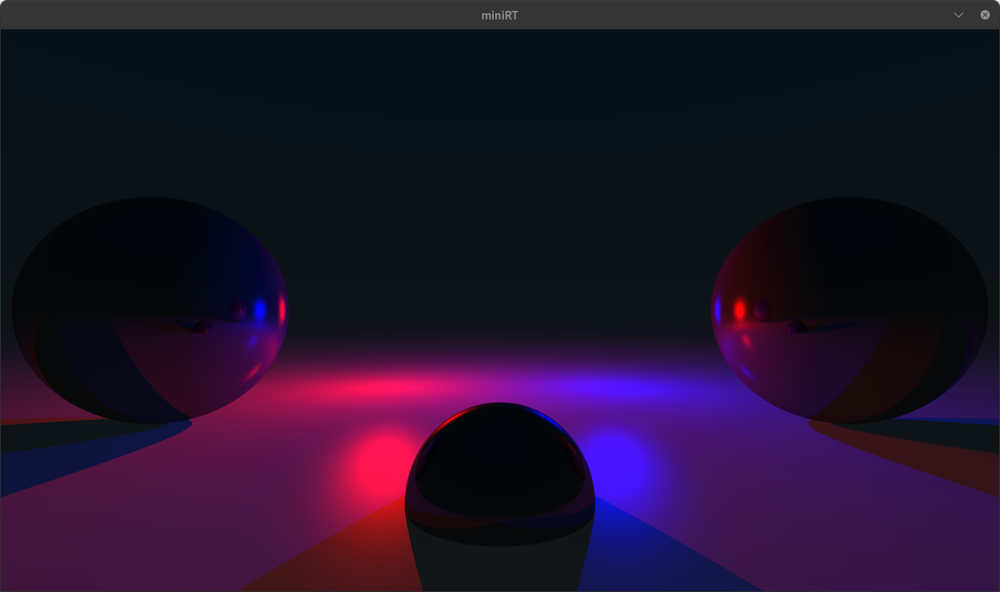
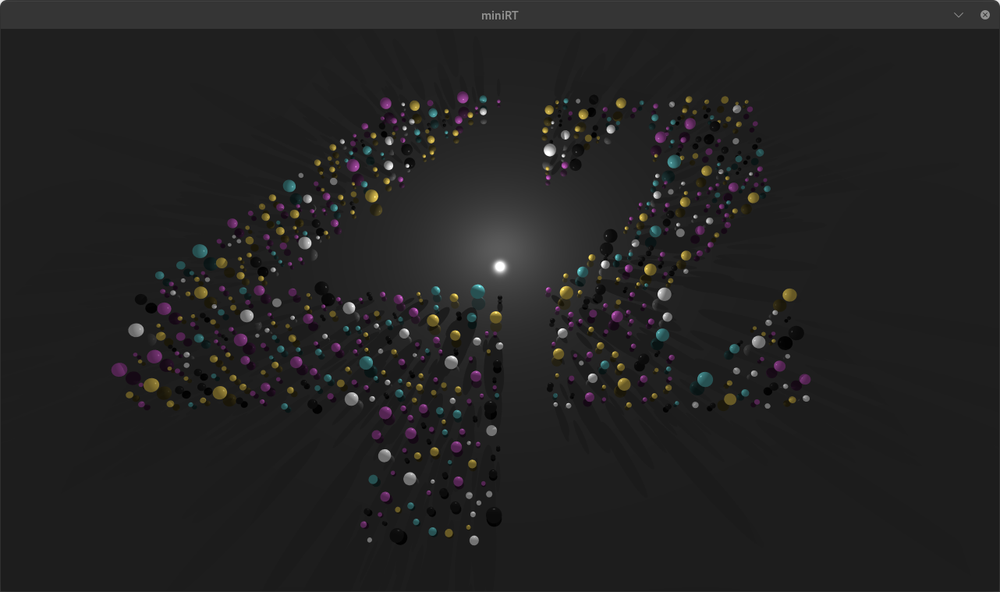
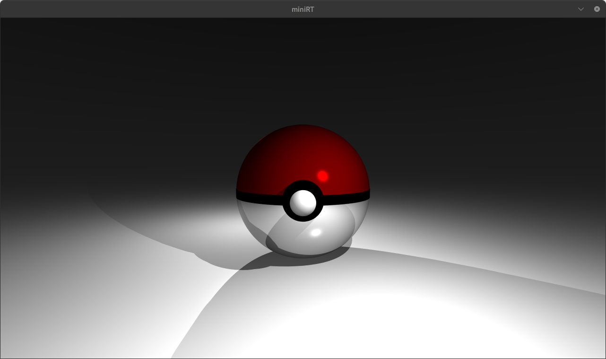

*This project has been created as part of the 42 curriculum by hguerrei and randrade*

# miniRT

*Rank 04 — a ray tracer, written from scratch.*



*`objects_room.rt` — translucent coloured walls, a mirrored sphere, and a glossy floor.*

## Description

miniRT reads a scene from a `.rt` file — a camera, some lights, and a handful of
geometric primitives — and renders it by ray tracing: for every pixel, cast a ray into
the scene, find what it hits first, and work out what colour that point should be.

There is no graphics library doing the work here. MiniLibX supplies a window and a way
to set individual pixels; everything between a scene file and an image is in this
repository — the vector maths, the ray/surface intersection algebra, the shading model,
and the recursive bounces that produce reflection and refraction.

Each primitive is its own quadratic. A sphere is a straightforward
`|P - C|² = r²` substitution, a plane is a single dot product, and a cylinder is a
quadratic restricted to a height range plus two disc caps that must be tested
separately — which is why the cylinder takes four source files and the sphere takes one.

The mandatory part asks for spheres, planes, cylinders, ambient and diffuse lighting,
and hard shadows. This implementation covers four of the subject's five bonuses on top of
that — a full Phong model, a checkerboard pattern, coloured multi-spot lights and the
cone — plus reflection, refraction, antialiasing and a live control panel for editing a
scene while it renders. See [Features](#features).

## Instructions

### Prerequisites

- `cc`, `make`
- **On Linux:** X11 development headers (`libx11-dev`, `libxext-dev` on Debian/Ubuntu)
- **On macOS:** [XQuartz](https://www.xquartz.org). MiniLibX is the X11 build on both
  platforms — macOS needs an X server rather than a different MiniLibX.

### Build

```sh
make          # auto-detects the host
make linux    # force the Linux link flags
make mac      # force the XQuartz link flags
```

MiniLibX and `Library/libft.a` are built first from their own Makefiles, then linked
with `-lm`. `make` picks the platform from `uname -s`; only the link line differs
(`-L/opt/X11/lib` on macOS), so the object files are identical either way and switching
platforms needs no `fclean`.

### Makefile targets

| Target        | Effect                                                        |
|---------------|---------------------------------------------------------------|
| `make`        | Build MiniLibX, libft, then `miniRT` (same as `all`)           |
| `make linux`  | Force the Linux/X11 link flags                                 |
| `make mac`    | Force the macOS/XQuartz link flags                             |
| `make clean`  | Remove the object directory                                    |
| `make fclean` | `clean` + remove the binary and `libft.a`                      |
| `make re`     | `fclean` then `all`                                            |
| `make val`    | Build, then run under Valgrind with fd tracking                |

Every scene in `maps/` also has a target that builds first, then runs it:

| Target | Scene | | Target | Scene |
|--------|-------|-|--------|-------|
| `make showcase` | `material_showcase.rt` | | `make room` | `objects_room.rt` |
| `make mirror` | `mirror_room.rt` | | `make pokeball` | `pokeball.rt` |
| `make lights` | `multi_color_lights.rt` | | `make logo` | `42.rt` |
| `make spheres` | `spheres.rt` | | `make planes` | `planes.rt` |
| `make cylinders` | `cylinders.rt` | | `make cones` | `cones.rt` |
| `make dots` | `sphere_dots.rt` | | | |

`make rt` runs any scene by name, and `val` honours the same variable:

```sh
make rt SCENE=mirror_room
make val SCENE=pokeball
```

### Usage

```sh
./miniRT maps/material_showcase.rt
```

Two windows open — the **render** and a **control panel** — and they have separate key
bindings, because each has its own hook.

#### Render window

| Key | Action |
|-----|--------|
| `W` `S` | Move the camera forward / back |
| `A` `D` | Move the camera left / right |
| `Q` `E` | Move the camera up / down |
| `R` | Reset the camera to the origin |
| `0` | Antialiasing **off** (1 sample) |
| `1` | Antialiasing **fast** — 16 samples |
| `2` | Antialiasing **medium** — 50 samples |
| `3` | Antialiasing **slow** — 100 samples |
| `ESC` | Quit cleanly |

Antialiasing re-renders the scene immediately and prints the mode it switched to. Each
step multiplies render time by roughly the sample count, so `1` is the one to reach for
while moving around and `3` is for the final look.

**Left-clicking an object in the render selects it** — the ray under the cursor is traced
into the scene, and whatever it hits becomes the control panel's current object.

### Control panel

The second window is 450×600 and is built entirely from raw pixel drawing: MiniLibX has
no widget toolkit, so every slider, dropdown and button here is drawn and hit-tested by
hand across the 32 files in `src/mlx/`.

It shows the currently selected object — with an icon for its type, from the XPM set in
`src/images/` — and lets you edit the scene live:

| Key | Action |
|-----|--------|
| `↑` `↓` | Cycle the object **type** — sphere → plane → cylinder → cone |
| `←` `→` | Cycle through the objects of that type |

The arrow keys belong to this window, not the render — they select objects, they do not
move the camera.

| Control | Effect |
|---------|--------|
| **Object selector** | The arrow keys above, or click an object in the render window |
| **RGB sliders** | Three sliders setting the selected object's colour, channel by channel |
| **Material dropdown** | Switch the object between solid, lambertian, metal, glass and checker |
| **Ambient light slider** | Raise or lower the scene's ambient term |
| **Render button** | Re-render with the current settings |

Sliders are click-and-drag with live hover feedback, and the panel redraws as values
change — so a material or colour can be tried against the actual lighting of the scene
instead of being guessed at in a text file and recompiled.

### Scenes

`maps/` holds eleven scenes:

| Scene | Shows |
|-------|-------|
| `material_showcase.rt` | every material on every primitive |
| `mirror_room.rt` | recursive reflection between metal surfaces |
| `multi_color_lights.rt` | several coloured lights and their blending |
| `objects_room.rt` | a furnished room |
| `pokeball.rt` | primitives composed into a recognisable object |
| `42.rt` | the 42 logo |
| `spheres.rt` `planes.rt` `cylinders.rt` `cones.rt` | one primitive at a time |
| `sphere_dots.rt` | many spheres |

`renders/` holds rendered images of six of them.

## Scene format

Each line declares one element, starting with its type identifier. The identifier is
**capitalised for the three scene-wide elements** — the ones the subject allows only
once per scene — and lower-case for objects, which may be repeated freely.

### Scene elements

| Identifier | Stands for | Syntax | Parameters |
|-----------|-----------|--------|------------|
| `A` | **A**mbient light | `A 0.2 255,255,255` | ambient ratio `[0,1]`, RGB |
| `C` | **C**amera | `C -50,0,20 0,0,1 70` | position, orientation vector `[-1,1]`, horizontal FOV `[0,180]` |
| `L` | **L**ight (spot) | `L -40,50,0 0.6 10,0,255` | position, brightness `[0,1]`, RGB |

`A` and `C` are declared exactly once. `L` is the exception to the capital-letter rule:
the subject allows a single light and leaves its RGB unused, but the *coloured and
multi-spot lights* bonus is implemented here, so `L` may be repeated and every light's
colour is honoured — see [Lighting](#lighting).

### Objects and materials



*`material_showcase.rt` — the whole grid at once. Columns left to right: lambertian,
metal, checker, glass, solid. Rows top to bottom: sphere, cylinder, cone. Even the walls
are materialed — checkered floor, solid back wall, lambertian and metal sides.*

Four primitives can be placed, any number of times each:

| Identifier | Object | Syntax | Parameters |
|-----------|--------|--------|------------|
| `sp` | Sphere | `sp 0,0,20.6 12.6 10,0,255 METAL` | centre, diameter, RGB, material |
| `pl` | Plane | `pl 0,0,-10 0,1,0 0,0,225 CHECKERPATTERN` | point on plane, normal, RGB, material |
| `cy` | Cylinder | `cy 50,0,20.6 0,0,1 14.2 21.42 10,0,255 GLASS` | centre, axis, diameter, height, RGB, material |
| `cn` | Cone | `cn 0,0,0 0,1,0 1 1 200,0,0 METAL` | centre, axis, diameter, height, RGB, material |

Sphere, plane and cylinder are the three the subject requires. **The cone is a bonus
primitive** — like the cylinder it is a quadratic clipped to a height range, with a disc
cap tested separately.

Each of them takes an optional trailing **material keyword** — this implementation's
extension to the subject's format. Any material works on any primitive, which is what
the grid above is showing. An object without one falls back to `LAMBERTIAN`, as the
plain spheres in `objects_room.rt` are written:

| Material | Behaviour |
|----------|-----------|
| `SOLID` | flat colour with basic shading |
| `LAMBERTIAN` | matte diffuse — low specular, low shininess |
| `METAL` | mirror-like, blends reflection with direct lighting |
| `GLASS` | transparent, refracts using an index of refraction |
| `CHECKERPATTERN` | procedural checkerboard (`CHECKER` is also accepted) |

`#` starts a comment. Any malformed value exits with `Error` and a specific message.

## Lighting

Shading is the **full Phong reflection model** — ambient, diffuse and specular summed
per light, each in its own file under `src/light/`.



*`sphere_dots.rt` — fifty spheres, three white lights. The tight highlight on each
sphere is the specular term; the three bright pools on the plane are the lights
themselves falling off with distance.*

- **Ambient** lifts everything off pure black, so nothing in shadow is truly invisible —
  `A` sets the ratio and colour.
- **Diffuse** is Lambert's cosine law: brightness follows the angle between the surface
  normal and the direction to the light.
- **Specular** is the highlight, and it is true Phong rather than Blinn-Phong — the
  light direction is reflected about the surface normal and dotted with the view
  direction, raised to the material's shininess. That exponent is what separates
  materials: `10.0` for lambertian gives a broad soft sheen, `96.0` for metal gives the
  tight bright dot.
- **Attenuation** falls off as `1 / (c + l·d + q·d²)` with the constants in
  `constants.h`, so distant lights genuinely dim instead of lighting the scene flatly.
- **Shadows** are hard: a shadow ray is cast toward each light, offset along its own
  direction by `0.001` so a surface cannot shadow itself.

### Coloured and multi-spot lights

`L` may appear as many times as you like, and each light carries its own RGB — the
subject leaves light colour unused in the mandatory part.



*`multi_color_lights.rt` — one red light and one blue, on metal spheres against a dark
ambient. Each light casts its own coloured pool and its own coloured specular dot, and
the two blend to magenta where they overlap.*

Because the specular term is multiplied by the light's colour and brightness, a red
light produces a red highlight rather than a white one — visible as the separate red and
blue dots on each sphere above.

Glass gets special treatment in shadowing: rather than blocking light like an opaque
object, a shadow ray that meets a glass surface is continued through it, so transparent
objects transmit light instead of casting solid black.

## Features

### Mandatory

Everything the subject requires:

| Feature | |
|---------|---|
| Sphere, plane, cylinder | all intersections and object interiors handled |
| Resizable object properties | sphere diameter, cylinder diameter and height |
| Translation and rotation | position and orientation vectors on objects, lights and camera |
| Ambient lighting | `A`, so nothing is ever fully black |
| Diffuse lighting | Lambert's cosine law |
| Hard shadows | one shadow ray per light, self-shadowing avoided by an epsilon offset |
| Window management | stays smooth when switching, minimising or resizing |
| `ESC` and the window cross | both quit cleanly |
| MiniLibX images | the scene is rendered into an image, not pixel-by-pixel to the window |
| `.rt` scene parsing | any misconfiguration exits with `Error` and a specific message |

### Bonuses

The subject lists five. Four are implemented:

| Subject bonus | Status |
|---------------|--------|
| Specular reflection for a full Phong model | **done** — `src/light/specular.c` |
| Colour disruption: checkerboard pattern | **done** — `CHECKERPATTERN` material |
| Coloured and multi-spot lights | **done** — repeatable `L`, each with its own RGB |
| One other second-degree object (cone, hyperboloid, …) | **done** — the cone, `cn` |
| Bump map textures | **to be done...** |

### Beyond the subject

The subject permits extending the scene format and adding features, so long as they are
justified. These are not on its bonus list:

| Feature | |
|---------|---|
| **Metal** material | mirror reflection blended with direct lighting |
| **Glass** material | refraction with an index of refraction; shadow rays pass *through* glass rather than being blocked |
| **Recursive bounces** | reflection and refraction to a depth of 10 (`MAX_CAMERA_BOUNCES`) |
| **Antialiasing** | supersampling at 16 / 50 / 100 samples, switchable at runtime |
| **Light attenuation** | `1 / (c + l·d + q·d²)` falloff, so distance matters |
| **Interactive control panel** | a second window for editing objects, colours, materials and ambient light while the scene renders |
| **Live camera** | fly through the scene with `WASD` / `QE`, re-rendering as you go |
| **Click-to-select** | clicking the render traces a ray to find the object under the cursor |

## Gallery

All six renders, every one produced by the scene of the same name in `maps/`. Reproduce
any of them with its Makefile target — `make room`, `make showcase`, `make dots`,
`make lights`, `make logo`, `make pokeball`.

### `objects_room.rt`


Translucent coloured walls, a mirrored sphere and a glossy floor — reflection and
refraction doing most of the work at once.

### `material_showcase.rt`


The full grid: five materials across, three primitives down, and materialed walls behind.
Detailed in [Objects and materials](#objects-and-materials).

### `sphere_dots.rt`


Fifty spheres under three white lights. The tight highlight on each one is the specular
term of the [Phong model](#lighting); the pools on the plane are the lights falling off
with distance.

### `multi_color_lights.rt`


One red light, one blue, on metal spheres against a dark ambient — each casting its own
coloured pool and its own coloured highlight, blending to magenta where they meet. See
[Coloured and multi-spot lights](#coloured-and-multi-spot-lights).

### `42.rt`



The logo built from **600 spheres** scattered across a single plane, shot from almost
directly overhead. One white point light sits low between the digits, which is what fans
all 600 shadows outward from the centre. Ambient at `0.45` keeps the spheres readable,
and mixing `METAL` in among the `SOLID` ones gives the scattered bright specks.

### `pokeball.rt`



Four spheres and two cylinders, nothing else: two hemispheres of different colours, a
cylinder for the black band and another for the button. Ambient is set to pure black
(`A 0 0,0,0`), so every bit of light in the frame comes from the three point lights —
which is why the backdrop falls away to nothing behind it.

## Project structure

```
MiniRT/
├── Makefile
├── includes/              # 21 headers, grouped by domain
│   ├── core/              # types, constants, the control-panel struct
│   ├── math/              # vec3, interval
│   ├── graphics/          # camera, ray, render, lighting, materials
│   ├── objects/           # sphere, plane, cylinder, cone
│   ├── ui/ system/ io/    # interface, MLX wrapper, parsing and errors
│   └── miniRT.h           # the umbrella header
├── src/                   # 92 .c files
│   ├── parsing/           # .rt reader and validation
│   ├── objects/           # intersection maths, one group per primitive
│   ├── ray/ render/       # ray generation and the render loop
│   ├── light/             # ambient, diffuse, specular, shadow
│   ├── textures/          # the five materials
│   ├── camera/            # framing and movement
│   ├── effects/           # antialiasing
│   ├── mlx/               # 32 files: the whole control panel
│   ├── errors/ utils/     # messages, vector maths, cleanup
│   └── images/            # XPM icons for the interface
├── maps/                  # 11 scenes
├── renders/               # 6 rendered images
└── Library/               # libft, ft_printf, get_next_line, minilibx-linux
```

## Implementation notes

- **Headers are organised by domain, not by source file.** Twenty-one headers under
  `core/`, `math/`, `graphics/`, `objects/`, `ui/`, `system/` and `io/`, with `miniRT.h`
  as the single umbrella. At 92 source files, a flat include directory would have
  stopped being navigable.
- **Every primitive reduces to a quadratic, and the caps are separate surfaces.** The
  cylinder is split across `cylinder_body.c`, `cylinder_caps.c`, `cylinder_collision.c`
  and `cylinder_utils.c` because the infinite-cylinder solution has to be clipped to the
  height range and then compared against two disc intersections; whichever is nearest
  wins. The cone splits the same way.
- **Hit testing goes through an interval.** `interval.c` wraps the valid range of `t`
  along a ray, which is what keeps a surface from shadowing itself: shadow rays start
  slightly off the surface rather than at exactly `t = 0`.
- **Materials are a dispatch, not a branch.** Each of the five lives in its own file
  under `textures/` with its own specular, shininess and refraction constants. Adding a
  sixth means adding a file and a keyword, not editing the shading path.
- **Reflection and refraction are recursive, bounded at 10.** `MAX_CAMERA_BOUNCES` caps
  the depth so a mirror facing a mirror terminates. `mirror_room.rt` is the scene that
  exercises it.
- **Antialiasing is supersampling.** `samples_per_pixel` rays are jittered within each
  pixel and averaged via `pixel_samples_scale`. It is toggleable at runtime because it
  multiplies render time by the sample count.
- **The control panel is a second MLX window.** 32 files under `src/mlx/` implement
  sliders, dropdowns, buttons and hit-testing from raw pixel drawing — MiniLibX provides
  no widgets whatsoever. Clicking an object in the render maps the click back to a scene
  object via `find_click_objects.c`, then syncs the panel's controls to it.
- **Built with `-O3`, deliberately not `-Ofast`.** Ray tracing is arithmetic-bound and
  the interactive camera re-renders on every keypress, so the optimiser earns its keep.
  `-Ofast` would go further, but it implies `-ffast-math` and with it
  `-ffinite-math-only` — the compiler is then licensed to assume infinities never occur.
  Every ray interval here is built as `interval_create(0.001, D_INFINITY)`, so the hit
  tests depend on exactly the value that assumption denies. `-O3` keeps the speed
  without the contradiction.

### Known limitations

- **macOS needs XQuartz.** There is no native Cocoa MiniLibX vendored here as there is
  in [so_long](../../Rank_2/so_long); the Linux MiniLibX is built against an X server
  instead. That is simpler — the keycodes and the whole MLX API stay identical across
  both platforms — but it does mean XQuartz has to be installed and running.

## Resources

- [*Ray Tracing in One Weekend*](https://raytracing.github.io/books/RayTracingInOneWeekend.html) — the standard starting point for this project
- [Phong reflection model](https://en.wikipedia.org/wiki/Phong_reflection_model)
- [`miniRT.pdf`](../../../../Subjects/Rank_4/miniRT.pdf) — the project subject
- [Libft](../../Rank_0/Libft), [ft_printf](../../Rank_1/ft_printf), [get_next_line](../../Rank_1/get_next_line) — bundled in `Library/`
